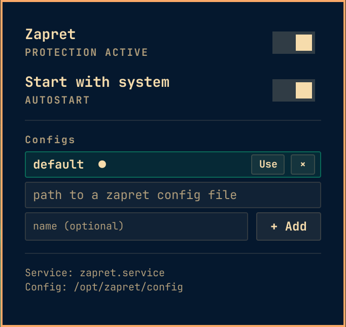

# kryaken.omarchy.zapret — Zapret DPI-circumvention controls

Omarchy bar widget + CLI to manage the systemd-managed `zapret` daemon: status,
start/stop, autostart, config profiles and logs.

This is a user-installed plugin; by itself it does not evade anything — it
controls whatever `zapret` installation you have on the system.

## Screenshots



## Compatibility

Built for the **Omarchy shell** (Hyprland + Quickshell, `qs.Commons` / `qs.Ui`
APIs, `schemaVersion` 1). It is an `omarchy plugin` bar widget for the
Omarchy bar and does not run in a standalone Quickshell or on other WMs.
Developed and validated on Omarchy 4.0.1.

## Requirements

- Omarchy with the shell, and `quickshell` running.
- A working `zapret` install with a `zapret` systemd unit and its config
  sourced from one of `/etc/zapret/config`, `/usr/local/etc/zapret/config` or
  `/opt/zapret/config` (override with `ZAPRET_CONFIG`). On Arch with an AUR
  helper this is `yay -S zapret`.
- Root (via `sudo` on a TTY or `pkexec` from the panel) to manage the unit and
  the config profile store under `/etc/zapret/configs`.

### Validate the setup

The panel shows a "REQUIRED SETUP" card with a copy-ready install command
whenever a dependency is missing. You can also verify dependencies from a
terminal:

```sh
bash ~/.config/omarchy/plugins/kryaken.omarchy.zapret/backend.sh doctor
```

## Install

1. Install straight from Git (this places the plugin under its id
   `kryaken.omarchy.zapret` and enables it for the shell):

   ```sh
   omarchy plugin add https://github.com/kryakenHub/KryakeN.Omarchy.Zapret.git --enable
   ```

2. Restart the shell and open the Zapret panel. On first use the plugin
   provisions a `default` config profile automatically and makes it the active
   one: it adopts your current live zapret config if one exists and actually
   enables a daemon, otherwise it deploys the bundled working config
   (`default.config`, nfqws on 80/443) and points the live config at it. The
   daemon is left off so the first click on the Zapret toggle cleanly turns it
   on — protection is up from the very first toggle, with no "Use" needed.
   Autostart (starting with the system) is left for you to enable explicitly.
   The first config you add later becomes active automatically too. To import
   the current stock zapret config as the `default` profile manually, run:

   ```sh
   sudo backend.sh configs migrate
   ```

Alternatively, install manually:

```sh
git clone https://github.com/kryakenHub/KryakeN.Omarchy.Zapret.git
cp -r KryakeN.Omarchy.Zapret ~/.config/omarchy/plugins/kryaken.omarchy.zapret
omarchy plugin validate "~/.config/omarchy/plugins/kryaken.omarchy.zapret"
```

Then add the widget to the bar in `~/.config/omarchy/shell.json`, e.g. in
`bar.layout.right`:

```jsonc
{ "id": "kryaken.omarchy.zapret" }
```

## Remove

Remove the widget from `shell.json`, then:

```sh
omarchy plugin remove kryaken.omarchy.zapret
```

The plugin never writes inside the plugin folder — runtime data lives in
`/etc/zapret/configs` and the `zapret` unit, and those are left untouched so
the daemon keeps working after the plugin is gone.

## Config profiles

Profiles are complete zapret `config` files stored directly under
`/etc/zapret/configs/<name>.config` — one file per profile, all in one folder.
`zapret.service` only ever reads `/opt/zapret/config`, so the single active
profile is symlinked over that path; switching profiles just re-points the
symlink and restarts the unit, without touching the rest of your zapret
install.

- On the first privileged `serve` session with an empty store, a `default`
  profile is provisioned and activated automatically: an existing plain live
  config is adopted, otherwise `default.config` (bundled next to `backend.sh`,
  overridable with `ZAPRET_DEFAULT_CONFIG`) is deployed and the live config is
  pointed at it. Existing setups are never touched.
- The same provisioning also runs on every `start`/`restart`/`toggle`, so a
  wiped profile store self-heals on the very next toggle without needing a
  shell restart.
- Starting/toggling also re-applies the active profile (guarantees the
  `/opt/zapret/config` symlink points at the profile) before launching, so a
  missing or broken symlink self-heals on the first toggle instead of the
  daemon failing to start.
- The **first added** profile is activated automatically.
- If applying a profile (select/migrate) would replace a plain, unmanaged live
  config, its bytes are preserved as the `default` profile first, so the stock
  setup stays recoverable.
- You cannot remove the profile that is currently active — select another first.

### CLI

```sh
backend.sh status                       # JSON: installed/active/enabled/config/strategy/profile/profiles
backend.sh installed                    # "yes"/"no"
backend.sh start | stop | restart | toggle
backend.sh enable | disable             # autostart with the system
backend.sh configs list                 # active profile + profile names
backend.sh configs add mycfg /path/to/zapret/config
backend.sh configs select mycfg         # switch; restarts the daemon if active
backend.sh configs remove mycfg
backend.sh configs migrate              # adopt a plain live config into the store
backend.sh logs [n]                     # last n journal lines (default 40)
```

Privileged commands (unit control, profile store) use `sudo` from a TTY and
`pkexec` from the panel.

## Authentication model (panel)

All privileged operations performed from the panel (toggle, autostart, config
add/select/remove/migrate) run through a single persistent helper process:
`pkexec backend.sh serve`. `kryaken.omarchy.vless` uses exactly the same scheme.

- The helper is **not** started at boot — only on your first privileged action
  in a shell session. Starting it is the only point where a password is asked
  (`pkexec`, `org.freedesktop.policykit.exec`, default `auth_admin` — no custom
  polkit rules are installed).
- Every further request is sent as a JSON line over the helper's stdin and
  answered on its stdout (`{"id":...,"args":[...]} -> {"id":...,"code":...}`),
  so no password is needed again for the rest of the session.
- The helper dies at logout (its stdin closes at session end) and holds no
  keep-alive; other `pkexec`/`sudo` programs are unaffected and keep asking for
  a password as usual.
- Handling it by hand:

```sh
   printf '%s\n' '{"id":1,"args":["toggle"]}' | pkexec "$HOME/.config/omarchy/plugins/kryaken.omarchy.zapret/backend.sh" serve
   ```

## Environment

| Var | Default | Meaning |
| --- | --- | --- |
| `ZAPRET_SERVICE` | `zapret` | systemd unit controlling the daemon |
| `ZAPRET_CONFIG` | auto | force the live config path |
| `ZAPRET_CONFIGS_DIR` | `/etc/zapret/configs` | profile store |
| `ZAPRET_DEFAULT_CONFIG` | bundled `default.config` | stock config deployed when none exists |
| `ZAPRET_PRIV` | `sudo`/`pkexec` | privilege wrapper (TTY vs panel) |
| `ZAPRET_FAKE_ROOT` | – | testing: skip self-elevation, run fs ops as the caller |

## AI assistance

This project was developed with AI assistance (vibecoding — pair-programming
with an LLM). Review the code and test it before relying on it for anything
sensitive.